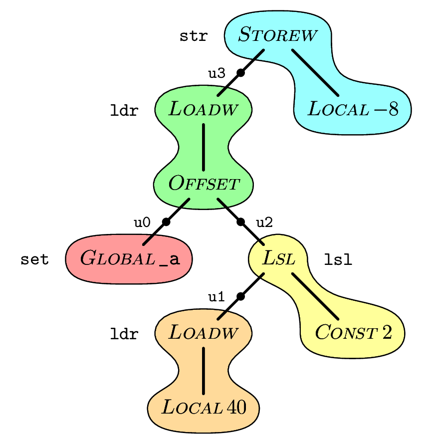

# opdraw
pdfTeX-based tool for rendering operator trees as PDF and PNG

This program, written in OCaml with a helper in C, takes a file containing a compact representation of a tiled operator tree and renders it as a diagram, with output as both a PDF file and a PNG file.  Operator trees are used in some compilers to represent statements in the body of a procedure, and instruction selection is implemented by covering each tree with tiles that correspond to machine instructions.



The syntax of the input language is fairly easy to deduce from the OCamlYacc script for the parser, and the example shown above is provided in the file `sample.op`:
````
tile str <STOREW,
  tile ldr u3 <LOADW,
    <OFFSET,
      tile set u0 <GLOBAL _a>,
      tile lsl u2 <LSL,
        tile ldr u1 <LOADW, <LOCAL 40>>,
        <CONST 2>>>>,
  <LOCAL -8>>
````
You can write `<op, t1, t2>` for an (e.g., binary) node and `<op>` for a leaf, where `op` is an operator and `t1`, `t2` are subtrees.  Writing `tile inst reg t` shows `t` as tiled with instruction `inst` and register `reg`; the register is optional, and if it is omitted then the instruction is optional too.  The tile covers the part of `t` up to subtrees that are themselves tiled, or are marked with the `untile` command.  Though the input syntax allows arbitrary tiles, the layout mechanism chokes on any tile that does not follow a single path in the tree: i.e., any tiled node can have at most one child in the same tile.  You can write `tile.lft` and `tile.rt` and `tile.ulft`, etc., to affect the placement of labels in cases where the layout mechanism doesn't get it right.

To work, the program needs both pdfTex (from TeX live) and imagemagick installed, and building it requires the OCaml compiler and also (for the helper) flex and bison.  Here's a suitable command to install the prerequisites under Debian:
````
sudo apt-get install texlive texlive-metapost imagemagick ghostscript ocaml-nox flex bison
````
When the tool is built, there's a shell script `script` that can be invoked as
````
./script sample.op
````
to run the program.  Edit options at the top of `script` to choose whether the tiles are shaded in rainbow colours, and to choose the output resolution for PNG.

The stages of conversion are as follows:
1. Use the `opdraw` program to convert the operator tree into a program written in MetaPost.
2. Render the MetaPost program to Postscript.  This involves invoking TeX as a sub-process to typeset the labels. 
3. Use the helper program `mp2pdf` to convert the MetaPost output into TeX input that will render as PDF.
4. Invoke pdfTeX on the resulting file, giving the diagram in cropped PDF form.
5. Use imagemagick to convert the PDF file into a PNG.

The final stage, converting from PDF to PNG, requires PDF reading to be enabled in Imagemagick.  As root, edit the file `/etc/Imagemagick/policy.xml` and delete a group of lines near the bottom of the file that prevent the use of Ghostscript to decode images, leaving the closing tag on the very last line.  Those lines are there because of a bug in earlier versions of Ghostscript that has apparently been fixed now.

## Files
For the OP --> MetaPost translation
````
opgram.mly      Parser for operator trees        
oplex.mll       Lexer for the operator tree language
optree.ml       Abstract syntax for operator trees
opmain.ml       Everything else
print.ml        Mike's own version of printf
print.mli       Interface definition for printf
````
For the MP to Postscript stage
````
opdraw.mp       Metapost macros
opdraw.tex      Tex macros used for embedded labels
cmcsci10.tfm    TeX font metrics for italic small caps
````
Program for translating MP output into pdfTeX input
````
mp2parse.y      Yacc parser and main program
mp2scan.l       Lexer
````
For rendering the resulting TeX as PDF
````
opdraw2.tex     pdfTeX settings
````
Bits and pieces
````
Makefile
README.md
sample.op
script
````
